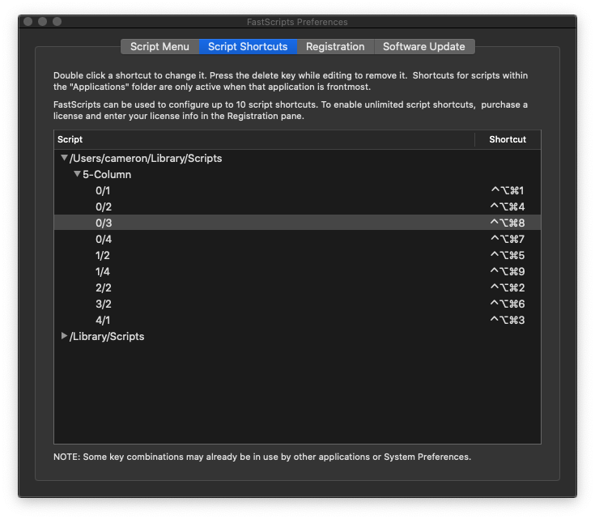

# The 5-column setup

1. Install [SizeUp](http://www.irradiatedsoftware.com/sizeup/)
2. Install [FastScripts](https://www.macupdate.com/app/mac/11432/fastscripts)
3. Put the 5-Column directory in this repo in `~/Library/Scripts` (create the folder if it's not already there)

Now you have shortcuts for 8 different combinations of a 5-column vertical grid.

Open up FastScripts Preferences from the toolbar menu, and go to `Script Shortcuts`.

The naming convention of the shortcuts is `column index/column width`, e.g. 0/1 is far left, 1 column wide.

Here's how mine are set up, this configuration works nicely with the number pad, but hey, you do you.

